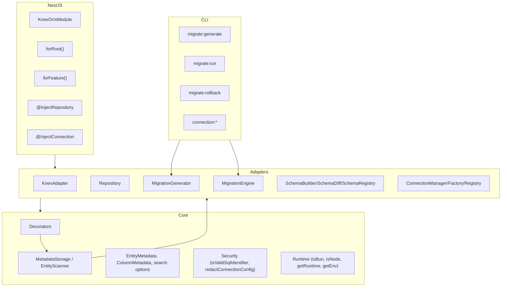

## Architecture overview

knex-orm follows a combination of **Clean Architecture** and **Hexagonal Architecture**, clearly separating:

- **Core**: decorators, metadata, types and interfaces (no external dependencies)
- **Adapters**: concrete implementations for Knex, generic repository, migration generation and connection management
- **Integrations**: NestJS module and CLI (`kor` / `knex-orm`)

This structure is reflected both in the folder layout (`src/core`, `src/adapters`, `src/nestjs`, `src/cli`) and in the interfaces exported from `src/index.ts`.

---

## Layer diagram

Simplified diagram (based on `docs/knex-orm-superset.md` §2):



---

## Typical data flows

### 1. Node.js “vanilla”

Based on `docs/knex-orm-superset.md` (§8) and the integration tests:

1. You define an entity using decorators (`@Entity`, `@PrimaryKey`, `@Column`).
2. You configure connections via `KnexORM.initialize` or `KnexORM.initializeFromPath`.
3. You obtain a repository for the entity using `orm.getRepository(Entity)`.
4. You call methods such as `create`, `find`, `update`, `delete`, `disable`, `paginate`.

Concrete flow:

- Your code → `KnexORM` / `Repository<T>` → `KnexAdapter` / Knex → database.

### 2. NestJS

Based on `src/nestjs/index.ts` and `test/integration/nestjs/nestjs-crud.spec.ts`:

1. `AppModule` imports `KnexOrmModule.forRoot` with the ORM configuration.
2. Domain modules import `KnexOrmModule.forFeature([Entity])`.
3. Services receive `IRepository<Entity>` via `@InjectRepository(Entity)`.
4. Optionally, `@InjectConnection('name')` injects the Knex instance.

Flow:

- Controller → Service → `IRepository<Entity>` → `Repository<T>` → Knex → database.

### 3. CLI and migrations

1. The CLI (`kor` / `knex-orm`) uses `EntityScanner` and `MetadataStorage` to discover entities.
2. `SchemaRegistry` loads the previous schema state from `.orm-schema.json`.
3. `SchemaDiff` computes operations (`createTable`, `addColumn`, `addIndex`, etc.).
4. `MigrationGenerator` and `MigrationWriter` generate Knex migration files.
5. The CLI runs migrations via `migrate:run` / `migrate:rollback` (using Knex under the hood).

---

## Architectural patterns

### Clean Architecture + Hexagonal

From a dependency point of view:

- The **core** defines **ports/interfaces**:
  - `IRepository<T>` (conceptually, reflected today in `Repository<T>` and exported types)
  - `IConnection` and configuration types (`OrmConfig`, `ConnectionEntry`)
  - `IMigrationGenerator` (implemented by `MigrationGenerator`)
- **Adapters** implement these interfaces and talk to:
  - **Knex** (for queries and migrations)
  - The **filesystem** (to persist `.orm-schema.json` and migrations)
- **Integrations** (NestJS, CLI) depend only on ports/adapters, never directly on the database.

This yields:

- Unit tests isolated for decorators, metadata, runtime and utilities
- Integration tests focused on:
  - `Repository<T>` + SQLite in‑memory
  - `MigrationEngine` + migration files
  - `KnexOrmModule` + NestJS TestingModule

### Data Mapper

The repository follows the **Data Mapper** pattern:

- Entities are **anemic** (no persistence logic).
- `Repository<T>` knows how to:
  - Map entities to DB rows (camelCase → snake_case)
  - Map rows back to entities (snake_case → camelCase)
  - Apply filters (`WhereClause`, `$in`, `$like`, etc.)

You can see this in `src/adapters/repository/repository.ts`, where:

- Methods like `mapRowToEntity` and `toRow` use metadata to perform the mapping.

---

## Folder structure

According to `docs/knex-orm-superset.md` and the current code:

```text
src/
  core/
    decorators/      # @Entity, @Column, @PrimaryKey, @CreatedAt, @UpdatedAt, @SoftDelete, @Index, etc.
    interfaces/      # Repository and connection interfaces (ports)
    metadata/        # MetadataStorage, EntityScanner
    security/        # isValidSqlIdentifier, redactConnectionConfig
    types/           # EntityMetadata, ColumnMetadata, search options
    utils/           # Helpers (e.g. camelCase/snake_case conversion)
    runtime/         # isBun, isNode, getRuntime, getEnv
  adapters/
    connection/      # KnexORM, ConnectionManager, ConnectionFactory, ConnectionRegistry, config loaders
    knex/            # KnexAdapter (implements IConnection on top of Knex)
    migration/       # MigrationEngine, MigrationGenerator, MigrationWriter, SchemaBuilder, SchemaDiff, SchemaRegistry
    repository/      # Repository<T> and related types
  nestjs/
    knex-orm.module.ts
    decorators/      # @InjectRepository, @InjectConnection
    constants.ts     # Injection tokens (getRepositoryToken, getConnectionToken, etc.)
  cli/
    migrate-generate.ts # CLI entry point (bins 'kor' / 'knex-orm')
  index.ts           # Public package entry point
```

This is the “source of truth” for where new files should live and how new features should be organized.

---

## Key decisions

Main decisions documented in `docs/knex-orm-superset.md` and reflected in the code:

- **Dual runtime (Node + Bun)**:
  - `src/core/runtime.ts` detects the runtime and exposes helper functions.
  - The public API is designed to work on both, as long as the DB driver is supported.
- **SQL safety**:
  - Knex already uses parameterized queries; the repository exposes `raw` with clear usage guidance.
  - Identifiers (tables, columns) are validated with `isValidSqlIdentifier` in decorators.
  - Sensitive connection data should be masked using `redactConnectionConfig` before logging.
- **Code‑driven migrations**:
  - The diff is always computed between **entities + metadata** and the last snapshot in `.orm-schema.json`.
  - There is no direct DB schema inspection; this simplifies the flow and avoids coupling to the actual DB state.
- **TDD as a first‑class discipline**:
  - TDD rules are defined in `.rules` and detailed in `docs/DEVELOPMENT.md`.
  - The test suite covers decorators, metadata, repository, migrations, CLI and NestJS end to end.

---

## Related documents

For deeper technical details:

- `docs/knex-orm-superset.md` — full architecture description, including diagrams, internal APIs and roadmap.
- `docs/AUDIT.md` — audit between documentation and implementation, useful to see what is roadmap vs already implemented.
- `docs/DEVELOPMENT.md` — internal development guide, folder structure and code conventions.
