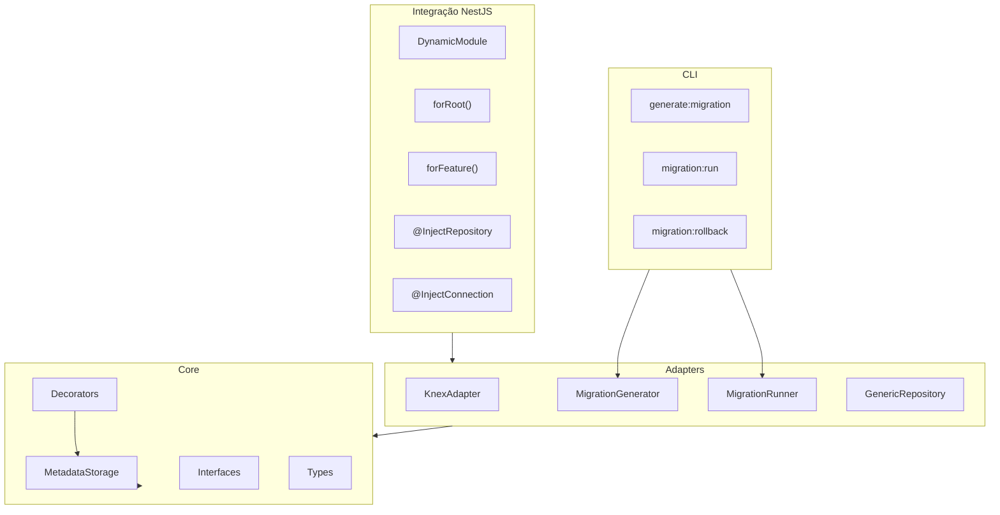
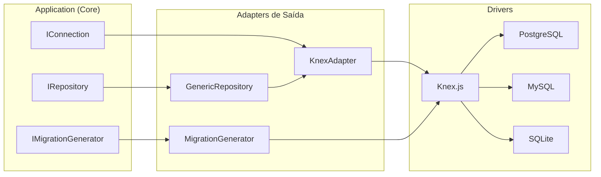
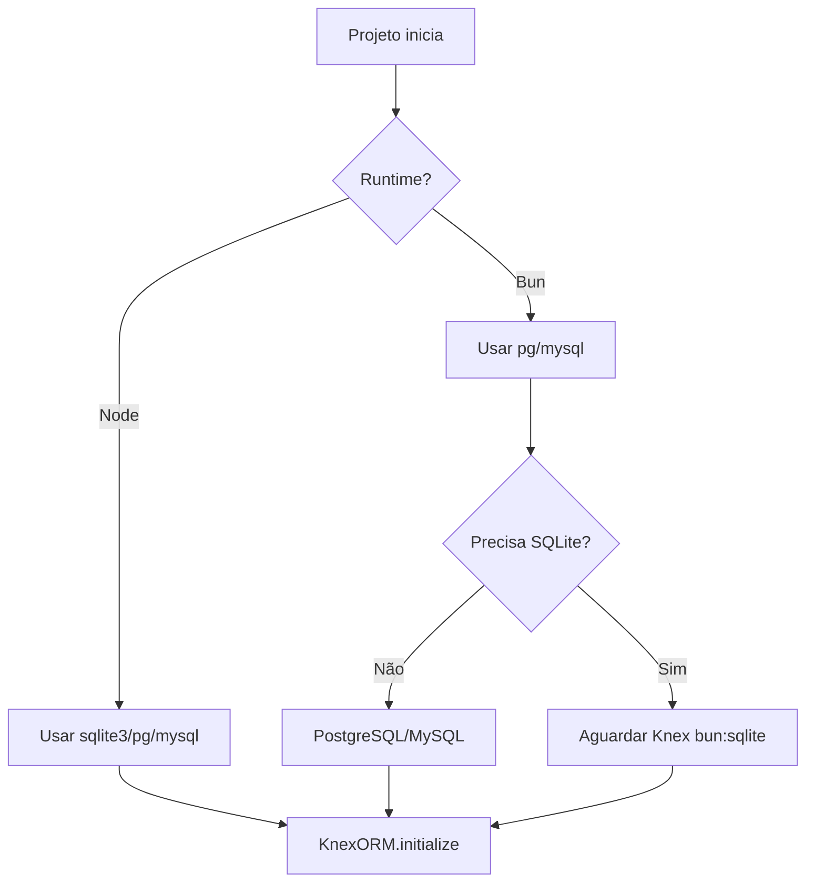

# KnexORM Superset — Documento de Arquitetura

> Biblioteca NPM que estende Knex.js com padrão ORM baseado em decorators, mantendo compatibilidade total com a API nativa do Knex.

---

## 1. Visão Geral e Motivação

### 1.1 Problema que Resolve vs Knex Puro

O **Knex.js** é um query builder poderoso e flexível, mas não oferece:

- **Mapeamento objeto-relacional**: entidades anêmicas com decorators que refletem o schema
- **Repositórios genéricos**: abstração CRUD tipada por entidade
- **Geração de migrations a partir de entidades**: diff de schema vs código
- **Integração nativa com NestJS**: DynamicModule, injeção de repositórios
- **Soft delete, timestamps automáticos**: convenções prontas

O **KnexORM Superset** adiciona essa camada sem substituir o Knex: o usuário continua podendo usar `knex('users').where(...)` quando precisar de controle fino.

### 1.2 Diferencial vs TypeORM / Prisma / MikroORM

| Aspecto        | KnexORM Superset                            | TypeORM                             | Prisma                | MikroORM             |
| -------------- | ------------------------------------------- | ----------------------------------- | --------------------- | -------------------- |
| **Base**       | Knex.js (query builder)                     | Próprio driver                      | Prisma Client         | Próprio driver       |
| **Schema**     | Decorators em classes TS                    | Decorators                          | `.prisma` declarativo | Decorators           |
| **Migrations** | Geração a partir de entidades + Knex nativo | Sincronização ou migrations manuais | `prisma migrate`      | Migrations manuais   |
| **SQL raw**    | Acesso direto ao Knex                       | `QueryRunner`                       | Limitado              | `em.getConnection()` |
| **Multi-DB**   | Via Knex (PG, MySQL, SQLite, MSSQL, Oracle) | Nativo                              | Nativo                | Nativo               |
| **NestJS**     | DynamicModule dedicado                      | Módulo oficial                      | Módulo oficial        | Módulo oficial       |

**Diferencial principal**: quem já usa Knex mantém o ecossistema e ganha convenções de ORM sem migrar para outra stack.

### 1.3 Compatibilidade

- **Runtimes**: Node.js ≥18, Bun ≥1.0
- **NestJS**: 9, 10 e 11
- **Node**: vanilla (sem framework), publicável no NPM para consumo em outros projetos
- **Bun**: runtime alternativo com suporte nativo
- **TypeScript**: 4.5+ com `experimentalDecorators` e `emitDecoratorMetadata`
- **Bancos**: PostgreSQL, MySQL/MySQL2, SQLite3, MSSQL, Oracle (via Knex)

---

## 2. Arquitetura

### 2.1 Diagrama de Camadas (Mermaid)



### 2.2 Clean Architecture + Hexagonal



- **Ports (interfaces)**: `IRepository<T>`, `IConnection`, `IMigrationGenerator`
- **Adapters**: `KnexAdapter` (implementa `IConnection`), `GenericRepository` (implementa `IRepository`), `MigrationGenerator` (implementa `IMigrationGenerator`)

### 2.3 Princípios SOLID Aplicados

| Princípio                 | Onde aparece na lib                                                                                              |
| ------------------------- | ---------------------------------------------------------------------------------------------------------------- |
| **S**ingle Responsibility | `MetadataStorage` só armazena metadata; `GenericRepository` só persiste; `MigrationGenerator` só gera migrations |
| **O**pen/Closed           | Novos tipos de coluna via extensão de `ColumnType`; novos drivers via `IConnection`                              |
| **L**iskov Substitution   | Qualquer implementação de `IRepository` pode substituir outra sem quebrar contratos                              |
| **I**nterface Segregation | `IRepository` expõe apenas métodos CRUD; `IConnection` apenas conexão; interfaces pequenas e focadas             |
| **D**ependency Inversion  | Core depende de `IRepository`, `IConnection`; adapters implementam essas interfaces                              |

### 2.4 Estrutura de Pastas do Projeto

```
knex-orm/
├── src/
│   ├── core/
│   │   ├── decorators/      # @Entity, @Column, @PrimaryKey, @Index, @Relation
│   │   ├── interfaces/      # IConnection, IRepository (ports)
│   │   ├── metadata/        # MetadataStorage, EntityScanner
│   │   ├── security/        # isValidSqlIdentifier, redactConnectionConfig
│   │   ├── types/           # ColumnType, EntityMetadata, QueryOptions
│   │   └── utils/           # toSnakeCase, getPrototypeConstructor
│   ├── adapters/
│   │   ├── connection/      # ConnectionManager, ConnectionFactory, ConnectionConfig, ConnectionRegistry
│   │   ├── knex/            # KnexAdapter implementa IConnection
│   │   ├── migration/       # MigrationEngine, MigrationGenerator, SchemaBuilder, SchemaDiff, SchemaRegistry
│   │   │   ├── schema/      # schema-types, schema-builder, schema-diff
│   │   │   └── storage/     # schema-registry (.orm-schema.json)
│   │   └── repository/      # Repository<T> (GenericRepository)
│   ├── nestjs/              # DynamicModule, providers, decorators NestJS
│   ├── cli/                 # kor / knex-orm
│   └── index.ts             # exports públicos da lib
├── test/
│   ├── unit/
│   └── integration/         # SQLite in-memory
├── examples/                # exemplos de entidades para migrate:generate
├── package.json
├── tsconfig.json
└── jest.config.js
```

---

## 3. Decorators de Entidade

### 3.1 Especificação Completa

| Decorator               | Descrição                                                               | Exemplo                                          |
| ----------------------- | ----------------------------------------------------------------------- | ------------------------------------------------ |
| `@Entity(tableName?)`   | Mapeia classe para tabela. Se omitido, usa nome da classe em snake_case | `@Entity('users')`                               |
| `@PrimaryKey(options?)` | Define PK. Opções: `autoincrement`, `uuid`                              | `@PrimaryKey()` ou `@PrimaryKey({ uuid: true })` |
| `@Column(options)`      | Define coluna. Opções: `type`, `nullable`, `default`, `unique`, `index` | `@Column({ type: 'string', nullable: false })`   |
| `@CreatedAt()`          | Campo `created_at` com default `CURRENT_TIMESTAMP`                      | `@CreatedAt()`                                   |
| `@UpdatedAt()`          | Campo `updated_at` com default `CURRENT_TIMESTAMP`                      | `@UpdatedAt()`                                   |
| `@SoftDelete()`         | Campo `deleted_at`, habilita `disable()` no repositório                 | `@SoftDelete()`                                  |
| `@Index(fields[])`      | Índice composto na tabela                                               | `@Index(['email', 'tenant_id'])`                 |
| `@Relation`             | Placeholder para v2 (OneToMany, ManyToOne, ManyToMany)                  | —                                                |

### 3.2 Tipos de Coluna Suportados (ColumnType)

Mapeamento para métodos do Knex Schema Builder:

- `string` → `table.string()`
- `integer`, `bigInteger` → `table.integer()`, `table.bigInteger()`
- `boolean` → `table.boolean()`
- `text` → `table.text()`
- `float`, `decimal` → `table.float()`, `table.decimal()`
- `date`, `datetime`, `timestamp` → `table.date()`, `table.datetime()`, `table.timestamp()`
- `json`, `jsonb` → `table.json()`, `table.jsonb()`
- `uuid` → `table.uuid()`

### 3.3 Exemplo de Entidade Anêmica

```typescript
import { Entity, PrimaryKey, Column, CreatedAt, UpdatedAt, SoftDelete } from 'knex-orm';

@Entity('users')
export class User {
  @PrimaryKey()
  id: number;

  @Column({ type: 'string', nullable: false, unique: true })
  email: string;

  @Column({ type: 'string' })
  name: string;

  @Column({ type: 'boolean', default: true })
  active: boolean;

  @CreatedAt()
  createdAt: Date;

  @UpdatedAt()
  updatedAt: Date;

  @SoftDelete()
  deletedAt?: Date;
}
```

---

## 4. GenericRepository<T>

### 4.1 Interface IRepository<T>

```typescript
interface WhereClause<T> {
  [K in keyof T]?: T[K] | { $eq?: T[K]; $ne?: T[K]; $in?: T[K][]; $like?: string };
}

interface FindOptions<T> {
  select?: (keyof T)[];
  where?: WhereClause<T>;
  orderBy?: { [K in keyof T]?: 'asc' | 'desc' };
  limit?: number;
  offset?: number;
  withDeleted?: boolean;
}

interface IRepository<T> {
  save(entity: Partial<T>, where?: WhereClause<T>): Promise<T>;
  find(options?: FindOptions<T>): Promise<T[]>;
  findOne(where: WhereClause<T>): Promise<T | null>;
  create(data: Partial<T>): Promise<T>;
  update(where: WhereClause<T>, data: Partial<T>): Promise<T>;
  delete(where: WhereClause<T>): Promise<void>;
  disable(where: WhereClause<T>): Promise<void>;
}
```

### 4.2 Semântica dos Métodos

| Método                 | Comportamento                                                          |
| ---------------------- | ---------------------------------------------------------------------- |
| `save(entity, where?)` | Sem `where` → INSERT; com `where` → UPDATE                             |
| `find(options?)`       | Suporta `select`, `where`, `orderBy`, `limit`, `offset`, `withDeleted` |
| `findOne(where)`       | `where` obrigatório em nível de tipo (TypeScript)                      |
| `create(data)`         | INSERT e retorna entidade com PK preenchida                            |
| `update(where, data)`  | UPDATE e retorna entidade atualizada                                   |
| `delete(where)`        | DELETE físico                                                          |
| `disable(where)`       | Seta `deleted_at`; requer `@SoftDelete()` na entidade                  |

Todos os métodos retornam a entidade mapeada (não row bruta).

### 4.3 Implementação Base

```typescript
class GenericRepository<T> implements IRepository<T> {
  constructor(
    private readonly connection: IConnection,
    private readonly entityClass: new () => T,
    private readonly metadata: EntityMetadata,
  ) {}

  async find(options?: FindOptions<T>): Promise<T[]> {
    let qb = this.connection.knex(this.metadata.tableName).select();
    if (this.metadata.softDelete && !options?.withDeleted) {
      qb = qb.whereNull('deleted_at');
    }
    // ... apply where, orderBy, limit, offset
    const rows = await qb;
    return rows.map((row) => this.mapRowToEntity(row));
  }

  async disable(where: WhereClause<T>): Promise<void> {
    if (!this.metadata.softDelete) {
      throw new Error('Entity does not support soft delete');
    }
    await this.connection.knex(this.metadata.tableName).where(where).update({ deleted_at: new Date() });
  }

  private mapRowToEntity(row: Record<string, unknown>): T {
    // Usa metadata para instanciar e preencher propriedades
    const instance = new this.entityClass();
    for (const [key, col] of Object.entries(this.metadata.columns)) {
      (instance as Record<string, unknown>)[key] = row[col.columnName];
    }
    return instance;
  }
}
```

---

## 5. Geração de Migrations

### 5.1 Fluxo do CLI

1. O CLI carrega entidades via `reflect-metadata` e `MetadataStorage` (a partir do módulo indicado em `--entities`)
2. Lê o schema anterior do arquivo `.orm-schema.json` (estado rastreado)
3. Calcula o **diff** entre metadata das entidades e o schema anterior
4. Gera arquivo de migration no formato Knex (`exports.up`, `exports.down`)
5. Atualiza `.orm-schema.json` com o novo estado

> **Nota:** O diff é calculado entre entidades e `.orm-schema.json`, não entre entidades e o banco. Para migrar, use `kor migrate:run` ou `knex-orm migrate:run`.

### 5.2 Comandos

**Binário CLI:** `kor` (atalho recomendado) ou `knex-orm`. Ambos disponíveis após `npm install knex-orm`.

| Comando                                  | Descrição                             |
| ---------------------------------------- | ------------------------------------- |
| `kor migrate:generate --entities=<path>` | Gera migration a partir das entidades |
| `kor migrate:run`                        | Executa `knex.migrate.latest()`       |
| `kor migrate:rollback`                   | Executa `knex.migrate.rollback()`     |

**Exemplos:**

```bash
npx kor migrate:generate --entities=./src/entities --migrations-dir=migrations
npx kor migrate:run
npx kor migrate:rollback
npx kor migrate:run --config=./knexfile.js
```

### 5.3 Diff de Schema

Operações suportadas:

- `createTable` — tabela não existe no schema anterior
- `addColumn` — coluna nova na entidade
- `alterColumn` — tipo/nullable/default alterado (gera comentário TODO; alter real depende do banco)
- `dropColumn` — coluna removida da entidade
- `addIndex` — `@Index` ou `@Column({ index: true })`
- `dropIndex` — índice removido

### 5.4 Schema Tracking (`.orm-schema.json`)

O arquivo `.orm-schema.json` armazena o estado anterior do schema (tabelas, colunas, índices) para cálculo do diff. É atualizado automaticamente após cada `migrate:generate` bem-sucedido. **Não confundir com schema do banco** — o diff é entidades vs `.orm-schema.json`.

### 5.5 Formato do Arquivo Gerado

```typescript
// migrations/20250311120000_create_users.ts
import type { Knex } from 'knex';

export async function up(knex: Knex): Promise<void> {
  await knex.schema.createTable('users', (table) => {
    table.increments('id').primary();
    table.string('email', 255).notNullable().unique();
    table.string('name', 255);
    table.boolean('active').defaultTo(true);
    table.timestamp('created_at').defaultTo(knex.fn.now());
    table.timestamp('updated_at').defaultTo(knex.fn.now());
    table.timestamp('deleted_at');
  });
}

export async function down(knex: Knex): Promise<void> {
  await knex.schema.dropTableIfExists('users');
}
```

---

## 6. Configuração de Conexões (KnexFile Simplificado)

### 6.1 orm.config.js / knex-orm.config.js

Crie `orm.config.js` na raiz do projeto (ou use `kor connection:init` para gerar template):

```javascript
/** @type {import('knex-orm').OrmConfig} */
module.exports = {
  default: 'primary',
  connections: {
    primary: {
      client: 'postgresql',
      connection: {
        host: process.env.DB_HOST,
        port: Number(process.env.DB_PORT),
        user: process.env.DB_USER,
        password: process.env.DB_PASSWORD,
        database: process.env.DB_NAME,
      },
      pool: { min: 0, max: 10 },
    },
    secondary: {
      client: 'mysql2',
      connection: {
        host: process.env.MYSQL_HOST,
        user: process.env.MYSQL_USER,
        password: process.env.MYSQL_PASSWORD,
        database: process.env.MYSQL_DATABASE,
      },
    },
    analytics: {
      client: 'sqlite3',
      connection: { filename: './analytics.db' },
    },
  },
};
```

**Múltiplos ambientes** — use chaves `development`, `test`, `production`:

```javascript
module.exports = {
  development: {
    default: 'primary',
    connections: { primary: { client: 'sqlite3', connection: { filename: ':memory:' } } },
  },
  test: { default: 'primary', connections: { primary: { client: 'sqlite3', connection: { filename: ':memory:' } } } },
  production: {
    default: 'primary',
    connections: {
      primary: {
        client: 'postgresql',
        connection: { host: process.env.DB_HOST /* ... */ },
      },
    },
  },
};
```

O ambiente é selecionado por `NODE_ENV` (padrão: `development`).

### 6.2 Bancos Suportados (via Knex)

- PostgreSQL (`pg` / `postgresql`)
- MySQL / MySQL2 (`mysql2`)
- SQLite3 (`sqlite3`)
- MSSQL (`mssql`)
- Oracle (`oracledb`)

### 6.3 Connection Registry e KnexORM

```typescript
import { KnexORM } from 'knex-orm';

const orm = await KnexORM.initializeFromPath();
const knex = orm.getConnection('primary');
const defaultKnex = orm.getDefaultConnection();

await orm.close();
```

Ou com config programático:

```typescript
const orm = await KnexORM.initialize({
  default: 'primary',
  connections: { primary: { client: 'sqlite3', connection: { filename: ':memory:' } } },
});
const knex = KnexORM.getConnection('secondary');
```

### 6.4 CLI de Conexões

| Comando               | Descrição                             |
| --------------------- | ------------------------------------- |
| `kor connection:init` | Cria `orm.config.js` com template     |
| `kor connection:test` | Valida todas as conexões configuradas |
| `kor connection:list` | Lista nomes das conexões              |

---

## 7. Integração NestJS

> **Status**: Implementado. Use o subpath `knex-orm/nestjs` para importar o módulo e decorators.

### 7.1 Configuração do Módulo

```typescript
import { Module } from '@nestjs/common';
import { KnexOrmModule } from 'knex-orm/nestjs';

@Module({
  imports: [
    KnexOrmModule.forRoot({
      default: 'primary',
      connections: {
        primary: {
          client: 'postgresql',
          connection: {
            /* ... */
          },
        },
      },
    }),
    KnexOrmModule.forFeature([User, Product]),
  ],
})
export class AppModule {}
```

### 7.2 Uso nos Serviços

```typescript
import { Injectable } from '@nestjs/common';
import type { IRepository } from 'knex-orm';
import { InjectRepository } from 'knex-orm/nestjs';
import { User } from './user.entity';

@Injectable()
export class UserService {
  constructor(@InjectRepository(User) private readonly userRepo: IRepository<User>) {}

  async findActiveUsers() {
    return this.userRepo.find({ where: { active: true } });
  }
}
```

### 7.3 Semântica

- **forRoot**: registra conexões globalmente e configura o módulo
- **forFeature**: registra repositórios para as entidades listadas
- **@InjectRepository(Entity)**: injeta `IRepository<Entity>`
- **@InjectConnection('name')**: injeta conexão nomeada (opcional)

### 7.4 Compatibilidade

- NestJS 9, 10 e 11 (testado com `@nestjs/core` e `@nestjs/common`)

---

## 8. Integração Node Vanilla

> **Status**: Implementado. Use `KnexORM.initialize()` e `orm.getRepository(Entity)` para Node sem framework.

```typescript
import 'reflect-metadata';
import { KnexORM } from 'knex-orm';
import { User } from './entities/user';

async function main() {
  const orm = await KnexORM.initialize({
    default: 'primary',
    connections: {
      primary: {
        client: 'sqlite3',
        connection: { filename: ':memory:' },
      },
    },
  });

  const userRepo = orm.getRepository(User);
  const users = await userRepo.find({ where: { active: true } });

  await orm.close();
}
```

### 8.1 API Node Vanilla

| Método                              | Descrição                                           |
| ----------------------------------- | --------------------------------------------------- |
| `KnexORM.initialize(config)`        | Inicializa conexões e retorna instância             |
| `KnexORM.initializeFromPath(path?)` | Carrega config de `orm.config.js` ou `knexfile.js`  |
| `orm.getRepository(Entity)`         | Retorna `Repository<Entity>` para a conexão default |
| `orm.getConnection(name?)`          | Retorna instância Knex (conexão nomeada)            |
| `orm.close()`                       | Fecha todas as conexões                             |

### 8.2 Compatibilidade

- **Node.js** ≥18 (ESM e CJS)
- **Bun** ≥1.0
- Sem dependências de framework

---

## 9. TDD — Estratégia de Testes da Lib

### 9.1 Estrutura por Camada

| Camada                 | Tipo        | Ferramentas                          | Estratégia                                    |
| ---------------------- | ----------- | ------------------------------------ | --------------------------------------------- |
| Decorators             | Unit        | Jest, ts-jest ou Bun test            | Mock de `Reflect.defineMetadata`              |
| MetadataStorage        | Unit        | Jest ou Bun test                     | Verificar armazenamento e leitura de metadata |
| Query Builder / Mapper | Unit        | Jest, jest-mock-extended ou Bun test | Mock de `knex`                                |
| GenericRepository      | Integration | Jest, SQLite in-memory (Node)        | Ciclo CRUD completo                           |
| GenericRepository      | Integration | Bun test, pg/mysql (Bun)             | Ciclo CRUD completo                           |
| MigrationGenerator     | Integration | Jest, SQLite in-memory               | Gerar migration e executar                    |

### 9.2 Configuração Recomendada

- **SQLite in-memory** para testes de integração em Node: `connection: { filename: ':memory:' }`
- **PostgreSQL/MySQL** para testes de integração em Bun (SQLite não suportado — ver Seção 13)
- **Isolamento**: cada teste ou suite usa um banco novo para evitar vazamento de estado
- **Mocks**: `jest-mock-extended` para mockar interfaces como `IConnection`

### 9.3 Runners Suportados: Jest e Bun test

A suite suporta **Jest** (Node) e **Bun test** com instruções claras:

| Runner   | Comando    | Runtime | SQLite       |
| -------- | ---------- | ------- | ------------ |
| Jest     | `npm test` | Node    | ✅ in-memory |
| Bun test | `bun test` | Bun     | ❌           |

**Jest:** padrão para CI e publicação NPM; usa `ts-jest` para TypeScript.

**Bun test:** opcional para desenvolvimento em Bun; ~15x mais rápido em cold start. Requer `/// <reference types="bun-types" />` ou import de `bun:test` nos arquivos de teste.

### 9.4 Coverage Alvo

- **Statements**: ≥ 90%
- **Branches**: ≥ 85%
- **Functions**: ≥ 85%
- **Lines**: ≥ 90%

### 9.5 Ferramentas

- **Jest** + **ts-jest** para execução em Node
- **Bun test** para execução em Bun (opcional)
- **SQLite3** para integração em Node
- **PostgreSQL/MySQL** para integração em Bun
- **jest-mock-extended** para mocks tipados (opcional; `jest.fn()` suficiente)

### 9.6 Implementação (Módulo 9)

| Recurso                        | Status                                                         |
| ------------------------------ | -------------------------------------------------------------- |
| Jest + ts-jest                 | ✅ `npm test`                                                  |
| Coverage thresholds            | ✅ statements 85%, branches 63%, functions 85%, lines 85%      |
| Bun test                       | ✅ `bun test --tsconfig-override=tsconfig.test.json`           |
| Repository CRUD integration    | ✅ `test/integration/repository/repository-crud.spec.ts`       |
| MigrationGenerator integration | ✅ `test/integration/migration/migration-generate-run.spec.ts` |
| Node Vanilla integration       | ✅ `test/integration/node-vanilla/`                            |
| Isolamento por suite           | ✅ `beforeEach` / `beforeAll` / `afterAll`                     |

---

## 10. Roadmap e Escalabilidade

### 10.1 v1.0 — Estado Atual

**Implementado:**

- [x] Decorators básicos (`@Entity`, `@Column`, `@PrimaryKey`, `@CreatedAt`, `@UpdatedAt`, `@SoftDelete`, `@Index`)
- [x] `Repository` (equivalente a GenericRepository) com CRUD completo
- [x] Geração de migrations a partir de entidades (`migrate:generate`)
- [x] `migrate:run` e `migrate:rollback` (via knexfile)
- [x] Schema tracking (`.orm-schema.json`)
- [x] Diff: createTable, addColumn, dropColumn, dropTable, addIndex, dropIndex
- [x] `KnexAdapter` (implementa `IConnection`)

**Implementado (Módulo 7):**

- [x] Integração NestJS (`KnexOrmModule`, `forRoot`, `forFeature`, `@InjectRepository`, `@InjectConnection`)

**Ainda não implementado (documentado como referência / roadmap):**

- [ ] `orm schema:sync` (auto-migrate) — previsto para v2.0

**Implementado (Módulo 6):**

- [x] `KnexORM.initialize()` / `KnexORM.initializeFromPath()` e Connection Registry
- [x] Config `orm.config.js` com múltiplos ambientes e conexões
- [x] CLI `connection:init`, `connection:test`, `connection:list`

**Implementado (Módulo 8):**

- [x] Integração Node Vanilla (`KnexORM.initialize`, `getRepository`, `find`, `close`)

**Implementado (Módulo 9):**

- [x] Estratégia TDD: Jest, coverage thresholds, integração SQLite, Bun test

### 10.2 v1.x

- **Relations**: `@OneToMany`, `@ManyToOne`, `@ManyToMany`
- **Query Builder fluente tipado**: encadeamento com tipos inferidos
- **Transactions e Unit of Work**: `orm.transaction(async (trx) => { ... })`

### 10.3 v2.0

- **Schema validation em runtime**: validação de dados antes de persistir
- **Migrations automáticas**: auto-migrate em ambiente de desenvolvimento
- **Plugin system**: extensões para auditoria, multi-tenancy, etc.

### 10.4 Implementação Módulo 10 (Roadmap e Escalabilidade)

| Item                                                  | Status                                |
| ----------------------------------------------------- | ------------------------------------- |
| Runtime detection (`isBun`, `isNode`, `getRuntime`)   | ✅ `src/core/runtime.ts`              |
| package.json: prepublishOnly, engines.bun, repository | ✅                                    |
| CI/CD: Node + Bun + build                             | ✅ `.github/workflows/ci.yml`         |
| SemVer + Conventional Commits                         | ✅ `docs/COMMITS_RULES.md`            |
| Estrutura extensível para v1.x/v2.0                   | ✅ Clean Architecture, ports/adapters |

---

## 11. Segurança e Performance

### 11.1 SQL Injection

- **Knex** usa **parameterized queries** por padrão; nunca concatenar SQL manualmente
- Todos os valores passados ao repositório são escapados via bindings

### 11.2 Connection Pooling

Configuração recomendada por banco (via Knex `pool`):

```typescript
{
  client: 'postgresql',
  connection: { /* ... */ },
  pool: { min: 2, max: 10 },
}
```

### 11.3 Índices

- Gerados automaticamente para `@PrimaryKey`
- Gerados para `@Column({ unique: true })` e `@Index(['col1', 'col2'])`

### 11.4 Soft Delete

- Queries **sempre** filtram `deleted_at IS NULL` por padrão
- `withDeleted: true` em `find()` para incluir registros deletados

### 11.5 Secrets

- **Nunca** logar connection strings ou credenciais
- Usar variáveis de ambiente e serviços como Vault em produção
- Usar `redactConnectionConfig(config)` antes de logar config

### 11.6 Implementação Módulo 11

| Item                                           | Status                                                                 |
| ---------------------------------------------- | ---------------------------------------------------------------------- |
| Validação de identificadores SQL               | ✅ `assertValidSqlIdentifier` em @Entity, @Column, @PrimaryKey, @Index |
| Repository.raw() JSDoc (parameterized queries) | ✅                                                                     |
| Connection pooling (pool min/max)              | ✅ ConnectionEntry.pool documentado                                    |
| Redact config para log seguro                  | ✅ `redactConnectionConfig()` exportado                                |
| Índices (PK, unique, @Index)                   | ✅ Já implementado                                                     |
| Soft delete                                    | ✅ Já implementado                                                     |

---

## 12. Publicação NPM

### 12.1 package.json

```json
{
  "name": "knex-orm",
  "version": "1.0.0",
  "description": "ORM superset for Knex.js with decorators, NestJS and Bun support",
  "main": "./dist/index.cjs",
  "module": "./dist/index.js",
  "types": "./dist/index.d.ts",
  "exports": {
    ".": {
      "import": {
        "types": "./dist/index.d.mts",
        "default": "./dist/index.mjs"
      },
      "require": {
        "types": "./dist/index.d.ts",
        "default": "./dist/index.cjs"
      }
    },
    "./nestjs": {
      "import": "./dist/nestjs/index.mjs",
      "require": "./dist/nestjs/index.cjs",
      "types": "./dist/nestjs/index.d.ts"
    }
  },
  "scripts": {
    "build": "tsc",
    "test": "jest",
    "test:node": "jest",
    "test:bun": "bun test"
  },
  "peerDependencies": {
    "knex": "^3.0.0",
    "reflect-metadata": "^0.2.0",
    "typescript": ">=4.5.0"
  },
  "devDependencies": {
    "knex": "^3.0.0",
    "reflect-metadata": "^0.2.0",
    "typescript": "^5.0.0",
    "jest": "^29.0.0",
    "ts-jest": "^29.0.0",
    "sqlite3": "^5.0.0"
  },
  "files": ["dist"],
  "engines": {
    "node": ">=18.0.0",
    "bun": ">=1.0.0"
  }
}
```

### 12.2 Build

- `tsup` para compilação (ESM + CJS)
- Saída: `dist/` com `.mjs` (ESM), `.js` (CJS) e `.d.mts`/`.d.ts` conforme exports

### 12.3 Versionamento

- **Semantic Versioning** (MAJOR.MINOR.PATCH)
- **Conventional Commits** para changelog automático (`feat:`, `fix:`, `BREAKING CHANGE:`)

### 12.4 CI/CD (GitHub Actions)

```yaml
# .github/workflows/ci.yml
jobs:
  test-node:
    runs-on: ubuntu-latest
    steps:
      - uses: actions/checkout@v4
      - uses: actions/setup-node@v4
        with:
          node-version: '20'
      - run: npm ci
      - run: npm test
  test-bun:
    runs-on: ubuntu-latest
    steps:
      - uses: actions/checkout@v4
      - uses: oven-sh/setup-bun@v1
      - run: bun install && bun test
  build:
    needs: [test-node, test-bun]
    runs-on: ubuntu-latest
    steps:
      - uses: actions/checkout@v4
      - uses: actions/setup-node@v4
      - run: npm ci && npm run build
      # npm publish --access public (executar apenas em release/tag)
```

### 12.5 Implementação Módulo 12

| Item                                                 | Status                    |
| ---------------------------------------------------- | ------------------------- |
| LICENSE (MIT)                                        | ✅ `LICENSE`              |
| package.json: license, homepage, bugs, publishConfig | ✅                        |
| files: dist, LICENSE, README.md                      | ✅                        |
| prepublishOnly (build + test)                        | ✅                        |
| pack:dry-run (validação sem publicar)                | ✅ `npm run pack:dry-run` |
| .npmignore (exclusões)                               | ✅                        |

---

## 13. Compatibilidade Dual Runtime (Bun + Node.js)

A biblioteca é projetada para rodar em **Node.js** (publicação NPM) e **Bun**, mantendo 100% de compatibilidade com ambos os runtimes. Consumidores podem usar a lib em projetos Node, NestJS ou Bun sem alterações no código.

### 13.1 Detecção de Runtime

A detecção programática segue a [documentação oficial do Bun](https://bun.sh/docs/guides/util/detect-bun):

```typescript
// src/core/runtime.ts

/**
 * Detecta se o código está rodando em Bun.
 * Funciona em TypeScript sem @types/bun.
 */
export function isBun(): boolean {
  return typeof process !== 'undefined' && !!process.versions?.bun;
}

/**
 * Detecta se o código está rodando em Node.js.
 */
export function isNode(): boolean {
  return typeof process !== 'undefined' && !process.versions?.bun;
}

/**
 * Retorna o runtime atual.
 */
export type Runtime = 'node' | 'bun';

export function getRuntime(): Runtime {
  return isBun() ? 'bun' : 'node';
}
```

Alternativa via global `Bun` (requer `@types/bun` em projetos TypeScript):

```typescript
if (typeof Bun !== 'undefined') {
  // Executando em Bun
}
```

### 13.2 Driver Strategy por Runtime

| Banco      | Node.js                       | Bun              |
| ---------- | ----------------------------- | ---------------- |
| PostgreSQL | `pg` (pure JS)                | `pg` ✅          |
| MySQL      | `mysql2` (pure JS)            | `mysql2` ✅      |
| SQLite     | `sqlite3` ou `better-sqlite3` | **Limitação** ⚠️ |

**Limitação conhecida — SQLite em Bun:** Os drivers `sqlite3` e `better-sqlite3` são native addons (node-gyp) e **não funcionam em Bun** (Bun usa JavaScriptCore, não V8). O Knex ainda não suporta `bun:sqlite` ([issue #6049](https://github.com/knex/knex/issues/6049)). Enquanto isso:

- **Node**: use `sqlite3` ou `better-sqlite3` normalmente
- **Bun**: use PostgreSQL ou MySQL para desenvolvimento e testes; SQLite ficará disponível quando o Knex adicionar suporte a `bun:sqlite`

```typescript
// Exemplo: configuração condicional para testes
const connection = isBun()
  ? { client: 'postgresql', connection: process.env.TEST_DATABASE_URL }
  : { client: 'sqlite3', connection: { filename: ':memory:' } };
```

### 13.3 Build e Bundle

A lib usa `tsc` para compilação e publicação no NPM. Para projetos que consomem a lib em Bun:

| Ferramenta  | Uso                   | Saída                           |
| ----------- | --------------------- | ------------------------------- |
| `tsc`       | Build da lib (NPM)    | `dist/` com ESM + CJS + `.d.ts` |
| `bun build` | Projetos consumidores | Bundle para deploy em Bun       |

Coexistência no `package.json` da lib:

```json
{
  "scripts": {
    "build": "tsc",
    "build:bun": "bun build ./src/index.ts --outdir ./dist --target node"
  }
}
```

O build principal permanece `tsc` para garantir compatibilidade NPM. Projetos que usam Bun podem consumir o pacote publicado normalmente.

### 13.4 Performance Delta

| Operação           | Node.js  | Bun    | Delta aproximado    |
| ------------------ | -------- | ------ | ------------------- |
| Startup (cold)     | ~200ms   | ~50ms  | ~4x mais rápido     |
| Queries PostgreSQL | baseline | ~1.1x  | Leve ganho          |
| Queries paralelas  | baseline | ~2x    | Ganho significativo |
| Testes (50 specs)  | ~1.2s    | ~0.08s | ~15x mais rápido    |

Os drivers `pg` e `mysql2` são pure JavaScript e funcionam em ambos os runtimes com desempenho similar; Bun tende a se destacar em startup e concorrência.

### 13.5 Compatibilidade de APIs

O Bun implementa as APIs Node.js relevantes ao Knex:

| API Node.js          | Suporte Bun | Observação                                |
| -------------------- | ----------- | ----------------------------------------- |
| `process`            | ✅          | `process.versions.bun` existe             |
| `Buffer`             | ✅          | Compatível                                |
| `fs` / `fs/promises` | ✅          | Mais rápido em Bun                        |
| `path`, `url`        | ✅          | Compatível                                |
| `http`, `https`      | ✅          | Compatível                                |
| `stream`, `crypto`   | ✅          | Maioria dos casos                         |
| Native addons        | ❌          | `sqlite3`, `better-sqlite3` incompatíveis |

### 13.6 Variáveis de Ambiente

`process.env` funciona em Node e Bun. O Bun também expõe `Bun.env`, equivalente:

```typescript
// Abstração opcional para acesso unificado
function getEnv(key: string): string | undefined {
  if (typeof Bun !== 'undefined' && Bun.env) {
    return Bun.env[key];
  }
  return process.env[key];
}

// Na prática: process.env é suficiente em ambos
const dbHost = process.env.DB_HOST ?? 'localhost';
```

Bun carrega `.env` automaticamente; em Node, use `dotenv` ou equivalente.

### 13.7 Scripts de Execução

```json
{
  "scripts": {
    "start": "node dist/index.js",
    "start:bun": "bun run dist/index.js",
    "dev": "tsx watch src/index.ts",
    "dev:bun": "bun --watch src/index.ts",
    "test": "jest",
    "test:bun": "bun test"
  }
}
```

Para a lib publicada no NPM, consumidores escolhem o runtime ao executar (`node` ou `bun`).

### 13.8 Testes: Jest e Bun test

A suite de testes suporta **Jest** (Node) e **Bun test** com instruções claras:

| Runner   | Comando    | Quando usar                           |
| -------- | ---------- | ------------------------------------- |
| Jest     | `npm test` | CI, Node, cobertura, ecossistema Jest |
| Bun test | `bun test` | Desenvolvimento em Bun, velocidade    |

**Jest (padrão):** mantém `jest.config.ts` e `ts-jest`. Testes de integração com SQLite in-memory em Node.

**Bun test:** adicione no topo dos arquivos de teste:

```typescript
/// <reference types="bun-types" />
import { describe, test, expect, beforeEach } from 'bun:test';
```

Ou use a diretiva para globals:

```typescript
/// <reference types="bun-types/test-globals" />
```

Para integração em Bun, use PostgreSQL ou MySQL (SQLite não suportado):

```typescript
// test/integration/user.repository.bun.test.ts
const knex = Knex({
  client: 'postgresql',
  connection: process.env.TEST_DATABASE_URL ?? 'postgres://localhost:5432/test',
});
```

**CI:** rode ambos para garantir compatibilidade:

```yaml
# .github/workflows/ci.yml
jobs:
  test-node:
    runs-on: ubuntu-latest
    steps:
      - run: npm ci && npm test
  test-bun:
    runs-on: ubuntu-latest
    steps:
      - uses: oven-sh/setup-bun@v1
      - run: bun install && bun test
```

### 13.9 Casos de Incompatibilidade e Workarounds

| Caso                    | Workaround                                                                    |
| ----------------------- | ----------------------------------------------------------------------------- |
| SQLite em Bun           | Use PostgreSQL/MySQL ou aguarde suporte do Knex a `bun:sqlite`                |
| `better-sqlite3` em Bun | Incompatível; use `bun:sqlite` diretamente se não depender do Knex            |
| Build Knex com Bun      | Evite `bun build` na lib; use `tsc` para publicar no NPM                      |
| `jest.mock` em Bun test | Bun test tem API compatível; `jest.mock()` foi adicionado em versões recentes |

### 13.10 Padrão Recomendado

| Cenário                  | Recomendação                                                             |
| ------------------------ | ------------------------------------------------------------------------ |
| **Projeto novo em Node** | Node + KnexORM; SQLite para dev/teste                                    |
| **Projeto novo em Bun**  | Bun + KnexORM; PostgreSQL/MySQL para dev/teste                           |
| **Migração Node → Bun**  | Trocar runtime; manter pg/mysql; migrar testes para Bun test             |
| **Lib consumida no NPM** | Build com `tsup` (ESM + CJS); consumidores usam Node ou Bun sem mudanças |

### 13.11 Implementação Módulo 13

| Item                                                  | Status                              |
| ----------------------------------------------------- | ----------------------------------- |
| Detecção de runtime (`isBun`, `isNode`, `getRuntime`) | ✅ `src/core/runtime.ts`            |
| Abstração env (`getEnv`)                              | ✅ `src/core/runtime.ts`            |
| Build dual ESM + CJS (tsup)                           | ✅ `.mjs` (ESM), `.js` (CJS)        |
| package.json exports condicionais                     | ✅ `import` → .mjs, `require` → .js |
| Typings .d.mts e .d.ts                                | ✅                                  |
| Scripts test:node, test:bun, dev, start, start:bun    | ✅                                  |
| CI: Node (Jest) + Bun (unit) + build                  | ✅ `.github/workflows/ci.yml`       |
| Testes Bun: apenas test/unit (SQLite incompatível)    | ✅                                  |

### 13.12 Diagrama de Decisão



---

## Decisões Arquiteturais (Resumo da FASE 1)

| Decisão                      | Escolha                                                                  | Justificativa                                                                                |
| ---------------------------- | ------------------------------------------------------------------------ | -------------------------------------------------------------------------------------------- |
| Data Mapper vs Active Record | **Data Mapper**                                                          | Entidades anêmicas, testabilidade, alinhado a TypeORM/MikroORM                               |
| Decorators → Schema Knex     | Metadata via `reflect-metadata` + mapeamento para `table.string()`, etc. | Padrão consolidado em TypeScript                                                             |
| Migrations                   | Diff de schema (entidade vs DB) + geração de arquivo Knex                | Reutiliza `knex.migrate.latest/rollback`                                                     |
| NestJS                       | DynamicModule com `forRoot`/`forFeature`                                 | Padrão oficial de libs NestJS                                                                |
| Multi-connection             | Connection Registry com nomes                                            | Alinhado a TypeORM DataSource e Sequelize                                                    |
| Testes                       | SQLite in-memory (integração) + mocks (unit)                             | Rápido, isolado, sem dependência externa                                                     |
| Dual runtime                 | Node.js + Bun                                                            | Publicação NPM; compatibilidade com pg/mysql em ambos; SQLite em Bun aguarda Knex bun:sqlite |

---

_Documento gerado com base em pesquisa web (Knex.js, TypeORM, MikroORM, Prisma, NPM, NestJS, SOLID, TDD, Clean Architecture) e decisões arquiteturais documentadas._
