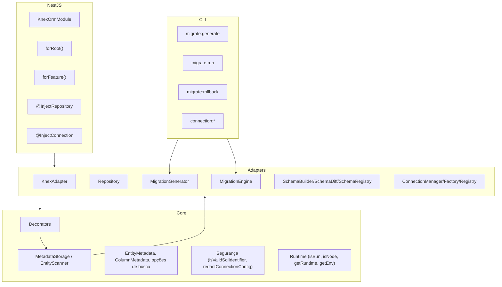

## Visão geral da arquitetura

O knex-orm segue uma combinação de **Clean Architecture** e **Arquitetura Hexagonal**, separando claramente:

- **Core**: decorators, metadata, tipos e interfaces (sem dependências externas)
- **Adapters**: implementação concreta para Knex, repositório genérico, geração de migrations e gestão de conexões
- **Integrações**: módulo NestJS e CLI (`kor` / `knex-orm`)

Essa organização aparece tanto na estrutura de pastas (`src/core`, `src/adapters`, `src/nestjs`, `src/cli`) quanto nas interfaces exportadas em `src/index.ts`.

---

## Diagrama de camadas

Diagrama simplificado (baseado em `docs/knex-orm-superset.md` §2):



---

## Fluxo de dados típico

### 1. Node.js “vanilla”

Com base em `docs/knex-orm-superset.md` (§8) e nos testes de integração:

1. Você define uma entidade com decorators (`@Entity`, `@PrimaryKey`, `@Column`).
2. Configura conexões via `KnexORM.initialize` ou `KnexORM.initializeFromPath`.
3. Obtém um repositório para a entidade com `orm.getRepository(Entity)`.
4. Usa métodos como `create`, `find`, `update`, `delete`, `disable`, `paginate`.

O fluxo concreto é:

- Seu código → `KnexORM` / `Repository<T>` → `KnexAdapter` / Knex → banco de dados.

### 2. NestJS

Com base em `src/nestjs/index.ts` e `test/integration/nestjs/nestjs-crud.spec.ts`:

1. O `AppModule` importa `KnexOrmModule.forRoot` com a configuração do ORM.
2. Módulos de domínio importam `KnexOrmModule.forFeature([Entity])`.
3. Serviços recebem `IRepository<Entity>` via `@InjectRepository(Entity)`.
4. Opcionalmente, `@InjectConnection('name')` injeta a instância Knex.

Fluxo:

- Controller → Service → `IRepository<Entity>` → `Repository<T>` → Knex → banco.

### 3. CLI e migrations

1. O CLI (`kor`/`knex-orm`) usa `EntityScanner` e `MetadataStorage` para descobrir entidades.
2. O `SchemaRegistry` carrega o estado anterior do schema de `.orm-schema.json`.
3. O `SchemaDiff` calcula operações (`createTable`, `addColumn`, `addIndex`, etc.).
4. O `MigrationGenerator` e o `MigrationWriter` geram arquivos de migration Knex.
5. O CLI executa migrations via `migrate:run`/`migrate:rollback` (usando Knex por baixo).

---

## Padrões arquiteturais

### Clean Architecture + Hexagonal

Do ponto de vista de dependências:

- O **core** define as **interfaces/ports**:
  - `IRepository<T>` (conceito, refletido hoje em `Repository<T>` e nos tipos exportados)
  - `IConnection` e tipos de configuração (`OrmConfig`, `ConnectionEntry`)
  - `IMigrationGenerator` (papel desempenhado por `MigrationGenerator`)
- Os **adapters** implementam essas interfaces, falando com:
  - **Knex** (para queries e migrations)
  - **Sistema de arquivos** (para persistir `.orm-schema.json` e migrations)
- As **integrações** (NestJS, CLI) dependem apenas de ports/adapters, não do banco diretamente.

Isso traz:

- Testes unitários isolados para decorators, metadata, runtime e utilitários
- Testes de integração focados em:
  - `Repository<T>` + SQLite in‑memory
  - `MigrationEngine` + arquivos de migration
  - `KnexOrmModule` + NestJS TestingModule

### Data Mapper

O repositório implementa o padrão **Data Mapper**:

- Entidades são **anêmicas** (sem lógica de persistência).
- O `Repository<T>` sabe como:
  - Transformar entidades em linhas de banco (camelCase → snake_case)
  - Mapear linhas em entidades (snake_case → camelCase)
  - Aplicar filtros (`WhereClause`, `$in`, `$like`, etc.)

Esse desenho pode ser visto em `src/adapters/repository/repository.ts`:

- Métodos como `mapRowToEntity` e `toRow` usam metadata para fazer o mapeamento.

---

## Estrutura de pastas

Conforme `docs/knex-orm-superset.md` e o código atual:

```
src/
  core/
    decorators/      # @Entity, @Column, @PrimaryKey, @CreatedAt, @UpdatedAt, @SoftDelete, @Index, etc.
    interfaces/      # Interfaces de conexão e repositórios (ports)
    metadata/        # MetadataStorage, EntityScanner
    security/        # isValidSqlIdentifier, redactConnectionConfig
    types/           # EntityMetadata, ColumnMetadata, opções de busca
    utils/           # Funções auxiliares (ex.: conversão camelCase/snake_case)
    runtime/         # isBun, isNode, getRuntime, getEnv
  adapters/
    connection/      # KnexORM, ConnectionManager, ConnectionFactory, ConnectionRegistry, loaders de config
    knex/            # KnexAdapter (implementa IConnection sobre Knex)
    migration/       # MigrationEngine, MigrationGenerator, MigrationWriter, SchemaBuilder, SchemaDiff, SchemaRegistry
    repository/      # Repository<T> e tipos associados
  nestjs/
    knex-orm.module.ts
    decorators/      # @InjectRepository, @InjectConnection
    constants.ts     # Tokens de injeção (getRepositoryToken, getConnectionToken, etc.)
  cli/
    migrate-generate.ts # Ponto de entrada do CLI (bin 'kor' / 'knex-orm')
  index.ts           # Ponto de entrada público do pacote
```

Essa estrutura é a “fonte de verdade” para onde colocar novos arquivos e como organizar novas funcionalidades.

---

## Decisões importantes

Principais decisões documentadas em `docs/knex-orm-superset.md` e refletidas no código:

- **Dual runtime (Node + Bun)**:
  - `src/core/runtime.ts` detecta o runtime e expõe funções utilitárias.
  - API da lib é pensada para funcionar em ambos, desde que o driver de banco seja suportado.
- **Segurança em SQL**:
  - O Knex já usa parameterized queries; o repositório expõe `raw` com recomendações claras de uso.
  - Identificadores (tabelas, colunas) são validados com `isValidSqlIdentifier` em decorators.
  - Dados sensíveis de conexão devem ser mascarados com `redactConnectionConfig` antes de logar.
- **Migrations dirigidas por código**:
  - O diff é sempre feito entre **entidades + metadata** e o último snapshot em `.orm-schema.json`.
  - Não há leitura direta do schema do banco; isso simplifica o fluxo e evita dependência do estado real do banco em ambientes diferentes.
- **TDD como disciplina oficial**:
  - Regras de TDD são definidas em `.rules` e detalhadas em `docs/DEVELOPMENT.md`.
  - A suite de testes cobre decorators, metadata, repositório, migrations, CLI e NestJS de ponta a ponta.

---

## Documentos complementares

Para detalhes mais profundos:

- `docs/knex-orm-superset.md` — descrição completa da arquitetura, incluindo diagramas, APIs internas e roadmap.
- `docs/AUDIT.md` — auditoria entre documentação e implementação, útil para entender o que é roadmap vs o que já está implementado.
- `docs/DEVELOPMENT.md` — guia para desenvolvimento interno, estrutura de pastas e convenções de código.
